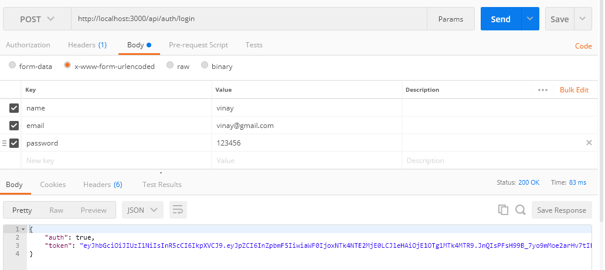
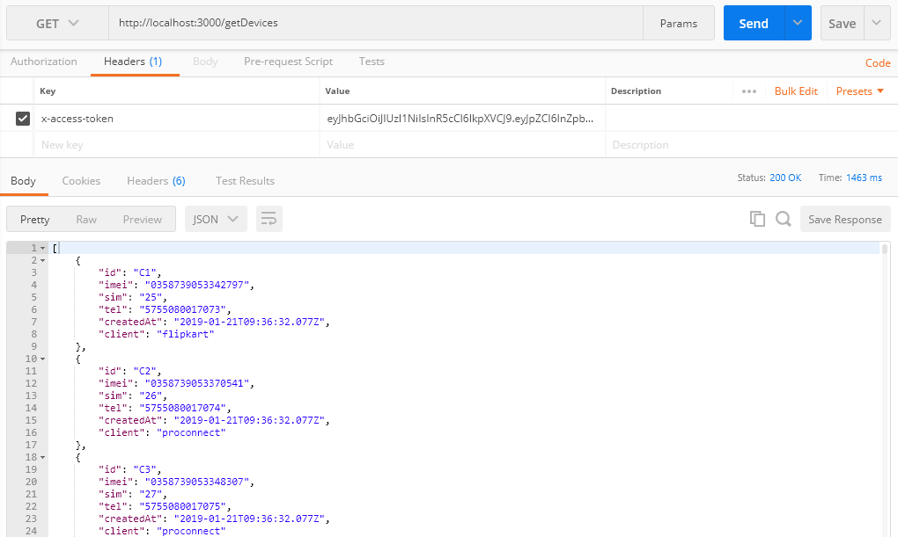
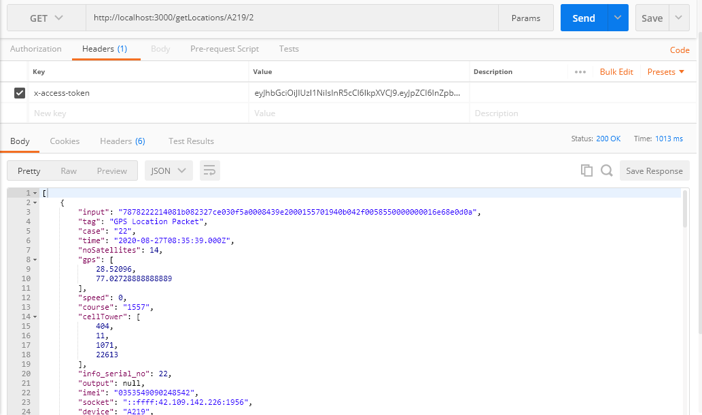
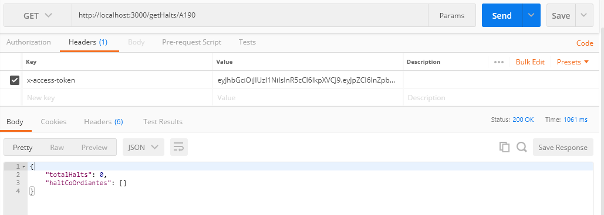

# Logistics_backend_development
Nodejs backend development for Login and MongoDB api transactions

### Install the packages : npm i

## Api endpoint to generate token once login.
The below token is a static one, validation can be happened by creating a collection in the cloud or local database.

### [Login uri(http://localhost:3000/api/auth/login), parameters : name, email, password, method : post]

For validation uncomment the code in AuthController.js file by sumitting the Db url.



## The below Api endpoint will generate the list of devices.

### [Get devices(http://localhost:3000/getDevices), method : get]




## Api endpoint which will return the locations.

### [Get devices(http://localhost:3000/getLocations/A219/2), parameters : device Id, page(optional) method : get]



## Api endpoint to return halts status of a container.

### [Get devices(http://localhost:3000/getHalts/A219/), parameters : device Id, method : get]

#### The taken example the device within a radius of 90m for more than 18 mins

#### The result will be the totoal halts and the mean of the gps Co-ordiantes of each halts

### The methods used are :

```
	distanceInKmBetweenEarthCoordinates(Method calculates the distance between the earth C0-0rdiantes in Meters)
	calculateTimeDifference(Methos calculats the difference between two GMT time formats in Minutes)
```




